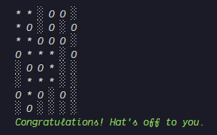

# Hat-Finder

Node.js console based retro game

## Game Goal

The Goal of the player is to navigate towards the hat, avoiding the holes on his way.

## Navigation

using keys W(up), S(down), A(left), D(right)

## Get Started

- `npm install`
- `node main.js`
